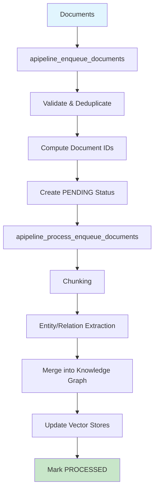
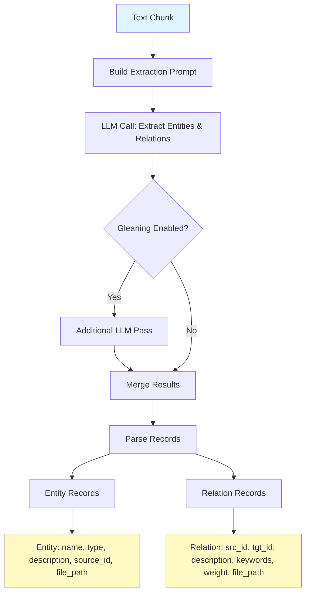
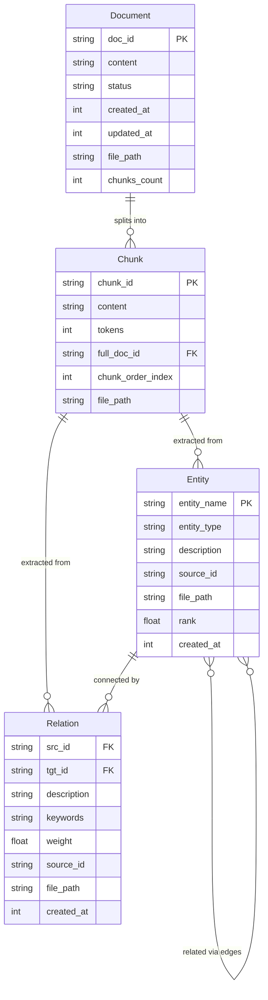
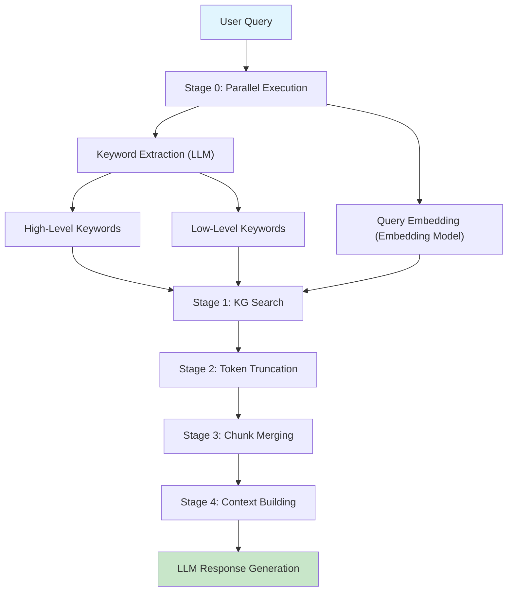
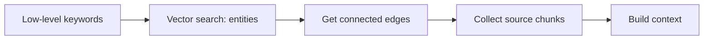
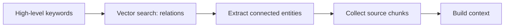
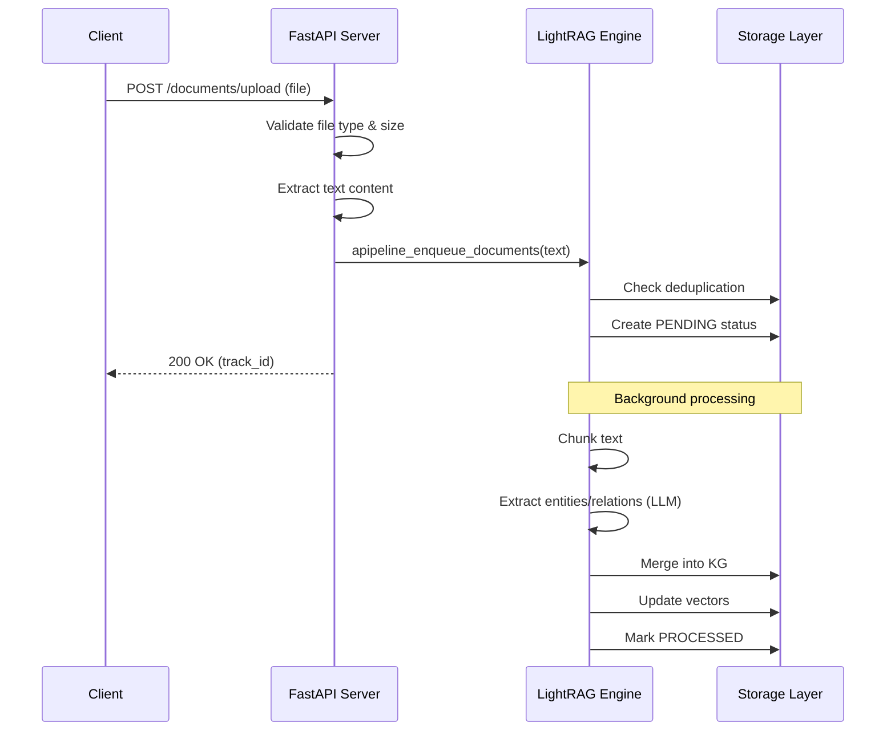
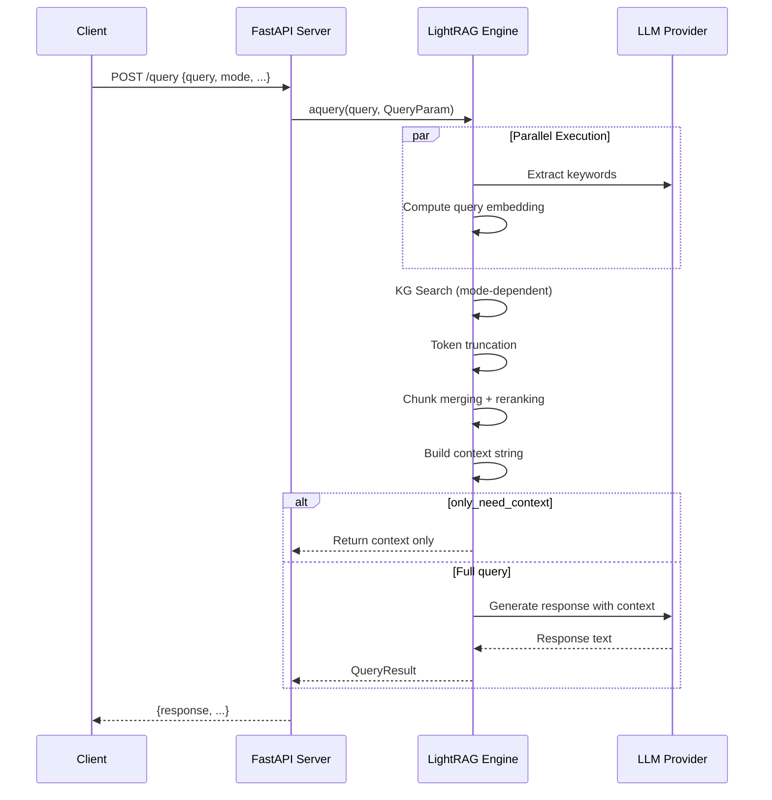
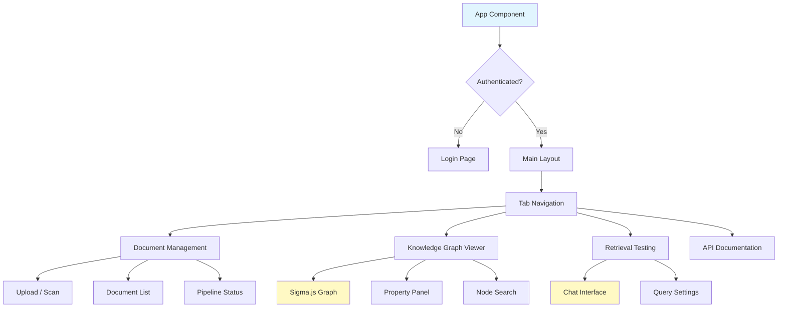

# LightRAG Architecture Documentation

A comprehensive technical guide to how LightRAG works end-to-end: from document ingestion through knowledge graph construction, storage, retrieval, and the API/UI layers.

---

## Table of Contents

1. [Ingestion Phase](#1-ingestion-phase)
2. [Storage Layer](#2-storage-layer)
3. [Retrieval System](#3-retrieval-system)
4. [API Server](#4-api-server)
5. [Web UI](#5-web-ui)

---

## 1. Ingestion Phase

The ingestion pipeline transforms raw documents into a queryable knowledge graph through a two-stage asynchronous pipeline.

### 1.1 High-Level Pipeline



### 1.2 Two-Stage Pipeline

#### Stage 1: Enqueue (`apipeline_enqueue_documents`)

1. **Input validation** -- accepts strings or list of strings, with optional custom IDs and file paths
2. **Document ID computation** -- generates MD5 hash IDs from content (`compute_mdhash_id`), or uses caller-provided IDs
3. **Deduplication** -- checks `doc_status_storage` to skip documents already processed or currently in-progress
4. **Status creation** -- creates `PENDING` entries in the doc status storage for each new document
5. **Content storage** -- stores full document text in `full_docs` KV storage

#### Stage 2: Process (`apipeline_process_enqueue_documents`)

1. **Batch processing** -- processes documents in parallel batches (controlled by `max_parallel_insert`, default: 2)
2. **Chunking** -- splits documents into token-sized chunks
3. **Entity/relation extraction** -- uses LLM to extract entities and relations from each chunk
4. **Merging** -- merges extracted entities/relations into the knowledge graph, deduplicating and summarizing descriptions
5. **Vector upsert** -- updates entity, relation, and chunk vector stores with embeddings
6. **Status update** -- marks documents as `PROCESSED` on success, or `FAILED` on error

### 1.3 Chunking Strategies

#### Token-Based Chunking (default)

**Function:** `chunking_by_token_size()` in `lightrag/operate.py:110`

Splits documents by token count with configurable overlap:

- Uses tiktoken tokenizer (default model: `gpt-4o-mini`)
- Sliding window with overlap to preserve context across chunk boundaries
- Optional `split_by_character` for pre-splitting on a delimiter (e.g., `\n`) before applying token limits

#### Section-Aware Chunking

**Function:** `section_aware_chunking()` in `lightrag/chunking.py`

Preserves document hierarchy by detecting section headers and maintaining breadcrumb prefixes:

- Detects markdown-style headers (`#`, `##`, etc.) and other structural markers
- Adds breadcrumb prefixes like `[Section > Subsection]` to each chunk for context preservation
- Falls back to token-based chunking within sections when sections exceed chunk size

#### Chunking Configuration

| Parameter | Env Var | Default | Description |
|-----------|---------|---------|-------------|
| `chunk_token_size` | `CHUNK_SIZE` | `1200` | Maximum tokens per chunk |
| `chunk_overlap_token_size` | `CHUNK_OVERLAP_SIZE` | `100` | Overlapping tokens between consecutive chunks |
| `split_by_character` | -- | `None` | Optional delimiter for pre-splitting |
| `split_by_character_only` | -- | `False` | If true, only split on character (error if chunk exceeds limit) |
| `tiktoken_model_name` | -- | `gpt-4o-mini` | Tokenizer model name |

### 1.4 Document Loading Engine

When uploading files via the API, LightRAG extracts text content based on file format:

| Category | Extensions | Engine |
|----------|-----------|--------|
| Plain Text | `.txt`, `.md`, `.mdx`, `.csv`, `.json`, `.xml`, `.yaml`, `.yml`, `.log`, `.conf`, `.ini` | Direct read |
| Rich Documents | `.pdf` | DOCLING (primary) or pypdf (fallback) |
| Office Documents | `.docx`, `.pptx`, `.xlsx` | DOCLING or python-docx/python-pptx/openpyxl |
| Other Documents | `.rtf`, `.odt`, `.tex`, `.epub`, `.html` | DOCLING or format-specific parsers |
| Source Code | `.py`, `.java`, `.c`, `.cpp`, `.js`, `.ts`, `.go`, `.rs`, `.rb`, `.sh`, etc. | Direct read |

**Configuration:**
- `DOCUMENT_LOADING_ENGINE` env var: set to `"DOCLING"` to use the DOCLING engine (falls back to format-specific libraries if unavailable)
- `PDF_DECRYPT_PASSWORD`: password for encrypted PDFs

### 1.5 Entity/Relation Extraction



**Process:**

1. **Prompt construction** -- builds a system prompt with entity type hints (configurable via `ENTITY_TYPES`) and a user prompt containing the chunk text
2. **LLM extraction** -- sends to the configured LLM, which returns structured tuples using `<|#|>` as delimiter and `<|COMPLETE|>` as completion marker
3. **Gleaning** (multi-pass extraction) -- if `entity_extract_max_gleaning > 0`, performs additional LLM calls asking for missed entities. Default: 1 gleaning pass
4. **Result parsing** (`_process_extraction_result`) -- splits output into records, handles LLM format errors, parses entity and relation tuples
5. **Entity cleaning** -- sanitizes names (uppercase normalization), truncates to `DEFAULT_ENTITY_NAME_MAX_LENGTH` (256 chars)

**Extracted entity fields:** `entity_name`, `entity_type`, `description`, `source_id` (chunk key), `timestamp`, `file_path`

**Extracted relation fields:** `src_id`, `tgt_id`, `description`, `keywords`, `weight`, `source_id`, `timestamp`, `file_path`

#### Extraction Configuration

| Parameter | Env Var | Default | Description |
|-----------|---------|---------|-------------|
| `entity_extract_max_gleaning` | `MAX_GLEANING` | `1` | Additional extraction passes |
| `entity_types` | `ENTITY_TYPES` | Person, Creature, Organization, Location, Event, Concept, Method, Content, Data, Artifact, NaturalObject | Entity categories to extract |
| `summary_language` | `SUMMARY_LANGUAGE` | `"English"` | Language for LLM prompts |

### 1.6 Merging

After extraction, entities and relations are merged into the knowledge graph in two phases:

**Function:** `merge_nodes_and_edges()` in `lightrag/operate.py`

#### Phase 1: Entity (Node) Merging

For each extracted entity:
1. Check if the entity already exists in the graph (by normalized name)
2. If exists: merge descriptions, accumulate source IDs, update weight
3. If new: create node with all extracted fields
4. **Description summarization** -- when an entity accumulates more than `force_llm_summary_on_merge` (default: 8) description fragments, or total tokens exceed `summary_max_tokens` (default: 1200), triggers LLM-based map-reduce summarization

#### Phase 2: Relation (Edge) Merging

Same pattern as entities:
1. Check for existing edge between the same source/target pair
2. Merge descriptions, accumulate weights, merge keywords
3. LLM summarization for long descriptions
4. Source ID management with configurable limits (`DEFAULT_MAX_SOURCE_IDS_PER_RELATION`: 300)

#### Merge Configuration

| Parameter | Env Var | Default | Description |
|-----------|---------|---------|-------------|
| `force_llm_summary_on_merge` | `FORCE_LLM_SUMMARY_ON_MERGE` | `8` | Description count threshold for LLM summary |
| `summary_max_tokens` | -- | `1200` | Token threshold for triggering summary |
| `summary_context_size` | -- | `12000` | Max tokens sent to LLM for summarization |
| `max_source_ids_per_entity` | -- | `300` | Max source chunk IDs per entity |
| `max_source_ids_per_relation` | -- | `300` | Max source chunk IDs per relation |
| `source_ids_limit_method` | -- | `FIFO` | How to evict old source IDs (`FIFO` or `KEEP`) |

---

## 2. Storage Layer

LightRAG uses four pluggable storage types with multiple backend implementations.

### 2.1 Data Model



### 2.2 Four Storage Types

#### KV Storage (`BaseKVStorage`)

Key-value storage used for multiple namespaces:

| Namespace | Purpose |
|-----------|---------|
| `full_docs` | Complete original document text |
| `text_chunks` | Individual text chunks with metadata |
| `llm_response_cache` | Cached LLM responses (extraction + query) |
| `full_entities` | Full entity data by name |
| `full_relations` | Full relation data by key |
| `entity_chunks` | Entity-to-chunk mappings |
| `relation_chunks` | Relation-to-chunk mappings |

**Key methods:** `get_by_id()`, `get_by_ids()`, `upsert()`

#### Vector Storage (`BaseVectorStorage`)

Embedding-based similarity search for three collections:

| Collection | Content | Use |
|------------|---------|-----|
| `entities` | Entity name + description embeddings | Entity search in local/hybrid/mix modes |
| `relationships` | Relation description embeddings | Relation search in global/hybrid/mix modes |
| `chunks` | Chunk content embeddings | Direct chunk search in naive/mix modes |

**Key methods:** `query()`, `upsert()`

#### Graph Storage (`BaseGraphStorage`)

Entity-relation knowledge graph (undirected):

- Nodes represent entities with properties (type, description, source_id, etc.)
- Edges represent relations between entity pairs with properties (description, weight, keywords, etc.)
- Supports batch operations: `get_nodes_batch()`, `node_degrees_batch()`, `get_edges_batch()`
- Edge queries: `get_node_edges()` for finding connected relations

**Key methods:** `upsert_node()`, `upsert_edge()`, `get_node()`, `get_edge()`, `get_node_edges()`

#### Doc Status Storage (`DocStatusStorage`)

Tracks document processing pipeline state:

| Status | Meaning |
|--------|---------|
| `PENDING` | Document enqueued, awaiting processing |
| `PROCESSING` | Currently being chunked/extracted/merged |
| `PROCESSED` | Successfully completed |
| `FAILED` | Processing failed (with error details) |

**Key methods:** `get_docs_by_status()`, `upsert()`, `get_status_counts()`

### 2.3 Backend Implementations

| Backend | KV | Vector | Graph | Doc Status | Best For |
|---------|:--:|:------:|:-----:|:----------:|----------|
| **JSON + NetworkX + NanoVectorDB** | JsonKV | NanoVectorDB | NetworkX | JsonDocStatus | Development, prototyping |
| **PostgreSQL** | PGKVStorage | PGVectorStorage | PGGraphStorage | PGDocStatusStorage | Production (single-DB) |
| **Redis** | RedisKVStorage | RedisVectorStorage | RedisGraphStorage | RedisDocStatusStorage | Production (high-performance) |
| **MongoDB** | MongoKVStorage | MongoVectorDBStorage | MongoGraphStorage | MongoDocStatusStorage | Production (document-oriented) |
| **Neo4j** | -- | -- | Neo4JStorage | -- | Graph-heavy workloads |
| **Milvus** | -- | MilvusVectorDBStorage | -- | -- | Large-scale vector search |
| **Qdrant** | -- | QdrantVectorDBStorage | -- | -- | Vector search with filtering |
| **Faiss** | -- | FaissVectorDBStorage | -- | -- | Local high-speed vector search |
| **Memgraph** | -- | -- | MemgraphStorage | -- | In-memory graph analytics |

### 2.4 Workspace Isolation

Each LightRAG instance can use a `workspace` parameter for multi-tenant data isolation:

| Backend Type | Isolation Method |
|-------------|-----------------|
| File-based (JSON, NetworkX, NanoVectorDB, Faiss) | Subdirectories under `working_dir` |
| Collection-based (Milvus, Qdrant) | Collection name prefixes |
| Relational DB (PostgreSQL) | Workspace column filtering |
| Redis | Key prefixes |
| MongoDB | Database/collection prefixes |
| Neo4j | Label prefixes or separate databases |

### 2.5 Storage Configuration

```python
rag = LightRAG(
    working_dir="./storage",
    workspace="my_project",       # Data isolation namespace
    kv_storage="JsonKVStorage",   # Default: file-based
    vector_storage="NanoVectorDBStorage",  # Default: file-based
    graph_storage="NetworkXStorage",       # Default: file-based
    doc_status_storage="JsonDocStatusStorage",  # Default: file-based
)
```

Environment variables for production backends:

| Backend | Required Env Vars |
|---------|-------------------|
| PostgreSQL | `POSTGRES_USER`, `POSTGRES_PASSWORD`, `POSTGRES_DATABASE` |
| Redis | `REDIS_URI` |
| MongoDB | `MONGO_URI`, `MONGO_DATABASE` |
| Neo4j | `NEO4J_URI`, `NEO4J_USERNAME`, `NEO4J_PASSWORD` |
| Milvus | `MILVUS_URI`, `MILVUS_DB_NAME` |
| Qdrant | `QDRANT_URL` (optional: `QDRANT_API_KEY`) |
| Memgraph | `MEMGRAPH_URI` |

---

## 3. Retrieval System

LightRAG supports 5 query modes plus a bypass mode, each providing different trade-offs between speed, accuracy, and knowledge graph utilization.

### 3.1 Query Execution Pipeline



### 3.2 Five Query Modes

#### Local Mode

Focuses on specific entities and their immediate relationships.



**Algorithm:**
1. Extract low-level (specific) keywords from the query
2. Vector search entity embeddings using keywords (top_k entities)
3. Retrieve connected edges for matched entities from the graph
4. Collect source text chunks referenced by entities/relations
5. Build LLM context from entities + relations + chunks

**Best for:** Specific factual questions, entity lookups, detail-oriented queries.

#### Global Mode

Leverages high-level relationship patterns across the knowledge graph.



**Algorithm:**
1. Extract high-level (thematic) keywords from the query
2. Vector search relationship embeddings using keywords (top_k relations)
3. Extract entities connected by matched relations
4. Collect source text chunks
5. Build LLM context

**Best for:** Broad questions, thematic queries, understanding connections between topics.

#### Hybrid Mode

Combines local and global approaches in parallel.

**Algorithm:**
1. Run local search (entities via low-level keywords) and global search (relations via high-level keywords) **in parallel**
2. Round-robin merge: interleave local and global results, deduplicating by entity name / relation key
3. Build unified context from merged results

**Best for:** General-purpose queries requiring both specific details and broad context.

#### Naive Mode

Direct vector search on text chunks without knowledge graph involvement.

**Algorithm:**
1. Compute query embedding
2. Vector search directly on chunk embeddings (top_k chunks)
3. Apply reranking if enabled
4. Build context directly from retrieved chunks (no entity/relation context)

**Best for:** Simple similarity search, when KG isn't populated, quick retrieval without graph overhead.

#### Mix Mode (Recommended with Reranker)

Combines knowledge graph retrieval with direct vector search for maximum coverage.

**Algorithm:**
1. Run **three searches in parallel:**
   - Local entity search (low-level keywords)
   - Global relation search (high-level keywords)
   - Direct vector chunk search
2. Round-robin merge KG results (local + global)
3. Merge vector chunks with KG-derived chunks
4. Apply reranking across all sources
5. Build unified context

**Best for:** Highest quality retrieval when a reranker is configured. Recommended default mode.

#### Bypass Mode

Sends query directly to LLM without any retrieval. Returns empty data arrays.

### 3.3 Mode Comparison

| Mode | Speed | Accuracy | Uses Graph | Uses Vectors | Best For |
|------|:-----:|:--------:|:----------:|:------------:|---------|
| `local` | Fast | High (specific) | Entities + Edges | Entity embeddings | Factual lookups |
| `global` | Fast | High (broad) | Relations + Nodes | Relation embeddings | Thematic questions |
| `hybrid` | Medium | Higher | Both | Entity + Relation | General questions |
| `naive` | Fastest | Moderate | No | Chunk embeddings | Simple similarity |
| `mix` | Slower | Highest | Both | All three | Production (with reranker) |
| `bypass` | Instant | N/A | No | No | Direct LLM queries |

### 3.4 Chunk Merging Methods

After entities and relations are retrieved, their source chunks need to be collected. Two methods are available:

| Method | Env Var Value | Description |
|--------|---------------|-------------|
| **WEIGHT** | `KG_CHUNK_PICK_METHOD=WEIGHT` | Selects chunks based on accumulated entity/relation weights. Faster, no additional embedding computation. |
| **VECTOR** (default) | `KG_CHUNK_PICK_METHOD=VECTOR` | Uses embedding similarity between the query and candidate chunks. More accurate, requires query embedding. |

### 3.5 Reranking

Reranking significantly improves retrieval quality by re-scoring retrieved chunks using a cross-encoder model.

**Flow:**
1. Retrieve candidate chunks (from KG and/or vector search)
2. Extract text content from each chunk
3. Call reranker model with (query, chunk) pairs
4. Re-sort by relevance score, optionally filtering by minimum score
5. Return top-N reranked results

**Supported rerankers:** Configured via `RERANK_BINDING` and `RERANK_MODEL` env vars:
- Cohere (`cohere`)
- Jina (`jina`)
- Aliyun/DashScope (`aliyun`)
- Generic API-based (`siliconflow`, etc.)
- Local rerankers via Infinity or similar services

| Parameter | Env Var | Default | Description |
|-----------|---------|---------|-------------|
| `enable_rerank` | `RERANK_BY_DEFAULT` | `true` | Enable reranking by default |
| Rerank binding | `RERANK_BINDING` | `null` | Reranker provider |
| Rerank model | `RERANK_MODEL` | -- | Model name for reranking |
| Min rerank score | `MIN_RERANK_SCORE` | `0.0` | Minimum relevance score threshold |
| Max rerank candidates | `MAX_RERANK_CANDIDATES` | `0` (unlimited) | Pre-filter before reranking |
| Min cosine for rerank | `MIN_COSINE_FOR_RERANK` | `0.0` | Cosine score filter before reranking |

### 3.6 QueryParam Configuration

| Parameter | Default | Description |
|-----------|---------|-------------|
| `mode` | `"mix"` | Query mode: `local`, `global`, `hybrid`, `naive`, `mix`, `bypass` |
| `top_k` | `40` | Entities/relations to retrieve from vector search |
| `chunk_top_k` | `20` | Text chunks to keep after retrieval/reranking |
| `max_entity_tokens` | `6000` | Token budget for entity context |
| `max_relation_tokens` | `8000` | Token budget for relation context |
| `max_total_tokens` | `30000` | Total token budget for entire context |
| `response_type` | `"Single Paragraph"` | LLM response format instruction |
| `stream` | `False` | Enable streaming output |
| `only_need_context` | `False` | Return raw context only (no LLM call) |
| `only_need_prompt` | `False` | Return full prompt only (no LLM call) |
| `enable_rerank` | `True` | Apply reranking to retrieved chunks |
| `include_references` | `False` | Include citation references in response |
| `user_prompt` | `None` | Additional instructions injected into LLM prompt |
| `conversation_history` | `[]` | Prior conversation turns for context |
| `model_func` | `None` | Override LLM model for this query |

### 3.7 Performance Optimizations

- **Parallel keyword + embedding extraction** -- keyword extraction (LLM) and query embedding (embedding model) run concurrently, reducing latency by ~20-40%
- **Batch graph operations** -- `get_nodes_batch()` and `node_degrees_batch()` fetch multiple nodes in a single call
- **Fast token approximation** (`truncate_list_by_token_size_fast`) -- uses character-count heuristic (~4 chars/token) for initial filtering, reducing tokenizer calls by ~50%
- **Parallel search in hybrid/mix modes** -- local, global, and vector searches run concurrently via `asyncio.gather()`
- **LLM response caching** -- query results cached by mode + parameters hash for repeat queries
- **Fast JSON serialization** -- `orjson`-based serialization with standard `json` fallback

---

## 4. API Server

### 4.1 Architecture

LightRAG provides a FastAPI server (`lightrag/api/lightrag_server.py`) with REST endpoints, an Ollama-compatible API, and a built-in React WebUI.

**Key components:**
- **FastAPI app** with CORS middleware, static file serving, and lifespan management
- **Router modules:** document routes, query routes, graph routes, Ollama API compatibility
- **Authentication:** JWT tokens + API key support + guest mode
- **Configuration:** Environment variables via `lightrag/api/config.py`

### 4.2 Document Endpoints

| Method | Path | Purpose |
|--------|------|---------|
| `POST` | `/documents/upload` | Upload a file (PDF, DOCX, TXT, etc.) for processing |
| `POST` | `/documents/text` | Insert a single text string |
| `POST` | `/documents/texts` | Insert multiple text strings in batch |
| `POST` | `/documents/scan` | Scan input directory for new documents |
| `GET` | `/documents` | List all documents with status (deprecated) |
| `POST` | `/documents/paginated` | Paginated document listing with filtering |
| `GET` | `/documents/status_counts` | Document count by processing status |
| `GET` | `/documents/pipeline_status` | Current pipeline processing status |
| `GET` | `/documents/track_status/{track_id}` | Track a specific insertion operation |
| `DELETE` | `/documents` | Clear all documents and data |
| `DELETE` | `/documents/delete_document` | Delete a specific document by ID |
| `DELETE` | `/documents/delete_entity` | Delete a specific entity |
| `DELETE` | `/documents/delete_relation` | Delete a specific relation |
| `POST` | `/documents/clear_cache` | Clear LLM response cache |
| `POST` | `/documents/reprocess_failed` | Reprocess documents with FAILED status |
| `POST` | `/documents/cancel_pipeline` | Cancel a running pipeline operation |

### 4.3 Query Endpoints

| Method | Path | Purpose |
|--------|------|---------|
| `POST` | `/query` | Standard RAG query (returns complete response) |
| `POST` | `/query/stream` | Streaming RAG query (NDJSON response) |
| `POST` | `/query/data` | Raw retrieval data only (no LLM generation) |

**Query modes explained:**

- **`/query`** -- sends query through full pipeline (retrieval + LLM generation), returns `{ response, ... }`
- **`/query/stream`** -- same pipeline but streams the LLM response as newline-delimited JSON chunks
- **`/query/data`** -- retrieval only (entities, relations, chunks, references, metadata) without calling the LLM. Useful for inspecting what the system retrieves, building custom UIs, or feeding results to external models

**Request body (shared):**
```json
{
  "query": "What is LightRAG?",
  "mode": "mix",
  "top_k": 40,
  "chunk_top_k": 20,
  "max_entity_tokens": 6000,
  "max_relation_tokens": 8000,
  "max_total_tokens": 30000,
  "response_type": "Single Paragraph",
  "stream": false,
  "enable_rerank": true,
  "only_need_context": false,
  "include_references": false,
  "user_prompt": null,
  "history_turns": 0
}
```

### 4.4 Graph Endpoints

| Method | Path | Purpose |
|--------|------|---------|
| `GET` | `/graph/label/list` | List all entity type labels |
| `GET` | `/graph/label/popular` | Get popular (most-connected) labels |
| `GET` | `/graph/label/search` | Search labels by keyword |
| `GET` | `/graphs` | Get graph data (nodes + edges) for visualization |
| `GET` | `/graph/entity/exists` | Check if an entity exists |
| `POST` | `/graph/entity/edit` | Edit entity properties |
| `POST` | `/graph/entity/create` | Create a new entity |
| `POST` | `/graph/relation/edit` | Edit relation properties |
| `POST` | `/graph/relation/create` | Create a new relation |
| `POST` | `/graph/entities/merge` | Merge two entities into one |

### 4.5 Authentication

LightRAG supports three authentication mechanisms:

1. **JWT Token Auth** -- username/password login via `/login` endpoint, returns JWT token with configurable expiration. Token auto-renewal supported.
2. **API Key Auth** -- static API key passed via `Authorization: Bearer <key>` header or `X-API-Key` header. Configured via `LIGHTRAG_API_KEY` env var.
3. **Guest Mode** -- read-only access without credentials. Enabled via `GUEST_MODE=true` env var. Guests can query but cannot modify data.

Auth accounts configured via `AUTH_ACCOUNTS` env var as JSON: `{"admin": "password123"}`.

### 4.6 Health Endpoint

`GET /health` returns system status including:
- Health status, pipeline busy state
- Core and API version numbers
- Full server configuration (storage backends, model settings, query defaults)
- Custom WebUI title/description

### 4.7 Document Upload Sequence



### 4.8 Query Sequence



---

## 5. Web UI

### 5.1 Tech Stack

| Technology | Purpose |
|-----------|---------|
| **React 19** | UI framework |
| **TypeScript** | Type-safe development |
| **Vite** | Build tool & dev server |
| **Bun** | Package manager & runtime |
| **Tailwind CSS** | Utility-first styling |
| **Zustand** | State management |
| **Sigma.js** | Graph visualization (force-directed layouts) |
| **i18next** | Internationalization (EN, ZH, FR, AR, ZH_TW, RU, JA, DE, UK, KO) |

### 5.2 Key Features

#### Document Management
- File upload (drag-and-drop) with format validation
- Directory scanning for batch imports
- Real-time processing status monitoring (PENDING / PROCESSING / PROCESSED / FAILED)
- Paginated document list with status filtering
- Individual document deletion
- Reprocess failed documents
- Pipeline cancellation

#### Query / Retrieval Testing
- Chat-style interface with conversation history
- All 6 query modes selectable
- Streaming response display
- LaTeX and Mermaid diagram rendering in responses
- User prompt history (last 12 prompts)
- Raw retrieval data viewing (`/query/data` integration)

#### Query Settings Panel
- Mode selector (local, global, hybrid, naive, mix, bypass)
- Token budget controls (entity, relation, total)
- Top-K and chunk top-K sliders
- Reranking toggle
- Response type selector
- Custom user prompt field
- `only_need_context` / `only_need_prompt` toggles

#### Knowledge Graph Visualization
- Interactive force-directed graph powered by Sigma.js
- Entity and relation search with highlighting
- Property panel showing entity/relation details
- Entity/relation CRUD (create, edit, merge)
- Configurable display: node labels, edge labels, edge sizes
- Layout controls: max iterations, max nodes
- Label filtering for focused views

#### Authentication
- JWT login form with username/password
- Guest mode for read-only access
- Automatic token renewal
- Token expiration tracking

### 5.3 State Management

The WebUI uses Zustand stores for state management:

| Store | Location | Purpose |
|-------|----------|---------|
| **Settings Store** | `stores/settings.ts` | Query settings, graph display preferences, theme, language, retrieval history |
| **Backend State Store** | `stores/state.ts` | Health check status, pipeline busy state, error messages |
| **Auth Store** | `stores/state.ts` | Authentication state, JWT tokens, guest mode, version info |

All settings are persisted to `localStorage` with migration support (current schema version: 21).

### 5.4 UI Architecture



### 5.5 API Client

The frontend communicates with the backend via `lightrag_webui/src/api/lightrag.ts`, which provides typed functions for all API endpoints:

- **Documents:** `uploadDocument()`, `insertText()`, `scanForDocuments()`, `deleteDocument()`, `getDocumentsPaginated()`, `getPipelineStatus()`, `getTrackStatus()`
- **Queries:** `queryRAG()`, `queryRAGStream()`, `queryRAGData()`
- **Graph:** `getGraphLabels()`, `getGraphData()`, `editEntity()`, `createEntity()`, `editRelation()`, `createRelation()`, `mergeEntities()`
- **System:** `checkHealth()`, `login()`

All requests include the JWT token from localStorage and handle token auto-renewal on 401 responses.

---

## Appendix: Key Source Files

| Area | File | Purpose |
|------|------|---------|
| Orchestrator | `lightrag/lightrag.py` | Main `LightRAG` class, `ainsert()`, `aquery()` |
| Chunking | `lightrag/operate.py:110-173` | Token-based chunking |
| Chunking | `lightrag/chunking.py` | Section-aware chunking |
| Extraction | `lightrag/operate.py:921-1043` | Entity/relation extraction result parsing |
| Merging | `lightrag/operate.py:1700-2100` | Node/edge merging logic |
| Query | `lightrag/operate.py:3024-4310` | `kg_query()`, `_build_query_context()` |
| Naive Query | `lightrag/operate.py:4878+` | `naive_query()` implementation |
| Base Classes | `lightrag/base.py` | `QueryParam`, `BaseKVStorage`, `BaseVectorStorage`, `BaseGraphStorage` |
| Constants | `lightrag/constants.py` | All default configuration values |
| Storage Registry | `lightrag/kg/__init__.py` | Backend implementation registry |
| Namespaces | `lightrag/namespace.py` | Storage namespace definitions |
| Utilities | `lightrag/utils.py` | Tokenizers, caching, reranking, fast JSON |
| API Server | `lightrag/api/lightrag_server.py` | FastAPI application |
| API Config | `lightrag/api/config.py` | Server configuration |
| Document Routes | `lightrag/api/routers/document_routes.py` | Document CRUD endpoints |
| Query Routes | `lightrag/api/routers/query_routes.py` | Query endpoints |
| Graph Routes | `lightrag/api/routers/graph_routes.py` | Graph CRUD endpoints |
| WebUI API Client | `lightrag_webui/src/api/lightrag.ts` | Frontend API layer |
| WebUI Stores | `lightrag_webui/src/stores/settings.ts` | Zustand state management |
