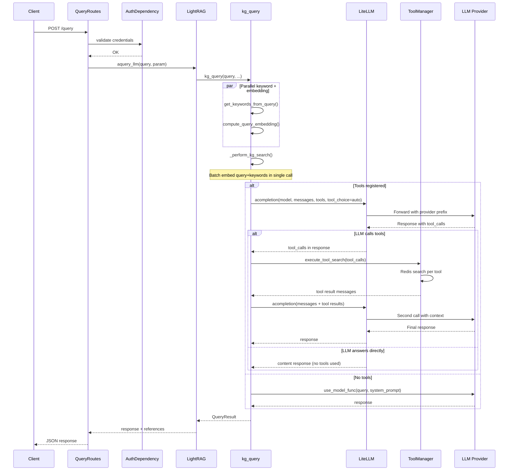
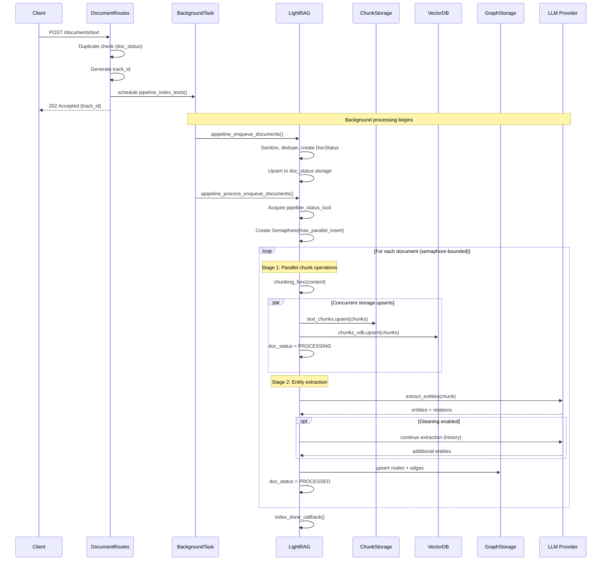
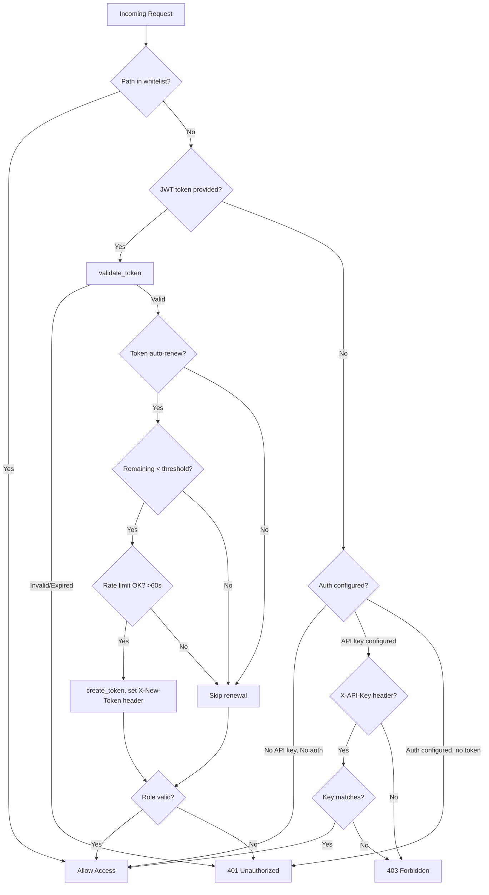
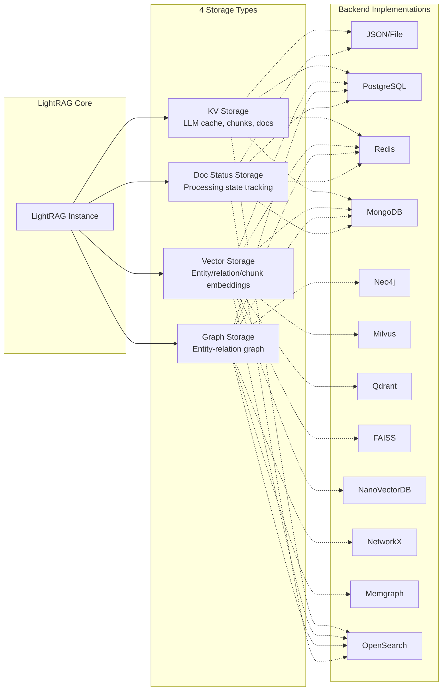
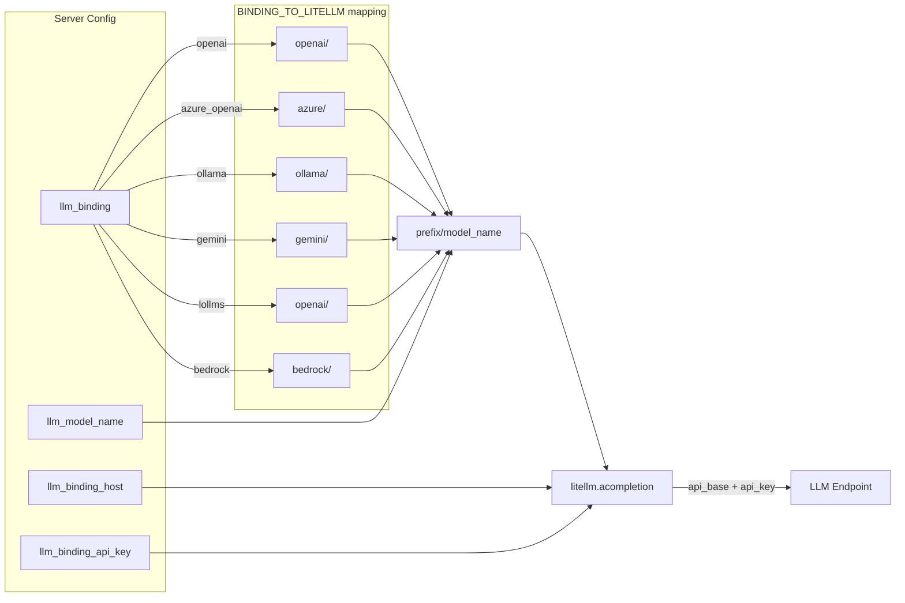
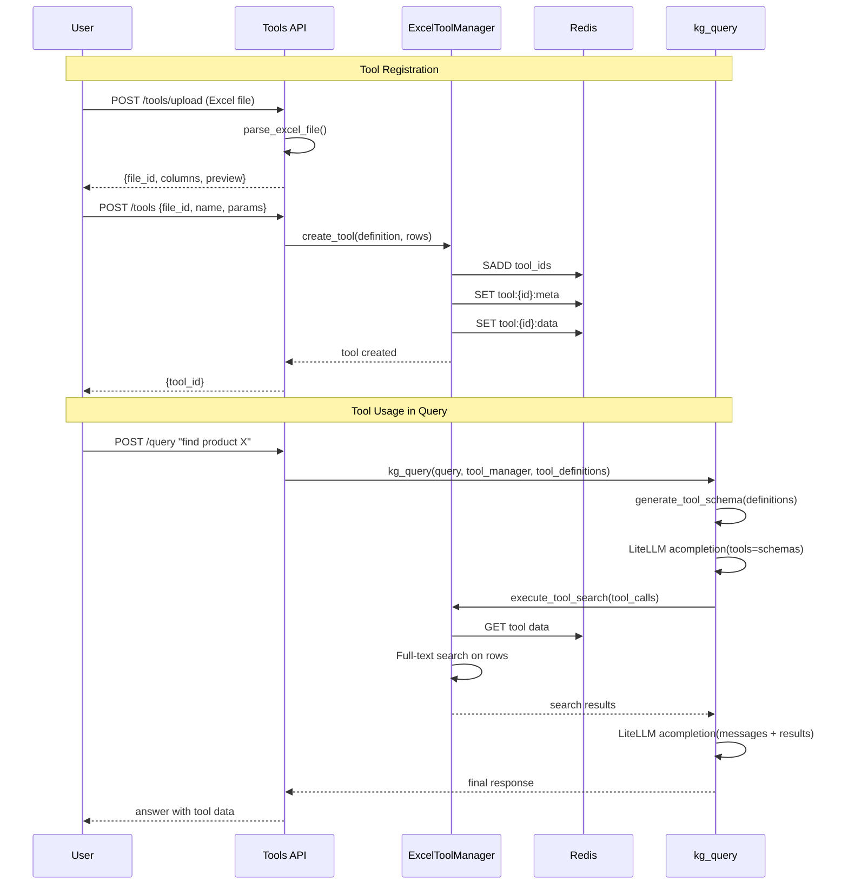

# LightRAG Architecture Diagrams

## 1. Query Flow (with Native Tool Calling)

The primary retrieval path. When Excel tools are registered, LiteLLM handles tool dispatch; otherwise falls back to the configured LLM function.

## 2. Document Insertion Pipeline

Documents are enqueued then processed in background with semaphore-controlled parallelism.

## 3. Authentication Flow

Supports JWT tokens, API keys, and unauthenticated access. Token auto-renewal prevents active session expiration.

## 4. Storage Architecture

Pluggable storage backends with 4 storage types. Each can use a different implementation.

## 5. LiteLLM Provider Routing

Maps `llm_binding` config to LiteLLM provider prefixes for native tool calling.

## 6. Excel Tool Lifecycle

Upload, configure, register, and use Excel-based tools in queries.

---

*Last updated: 2026-04-14*
